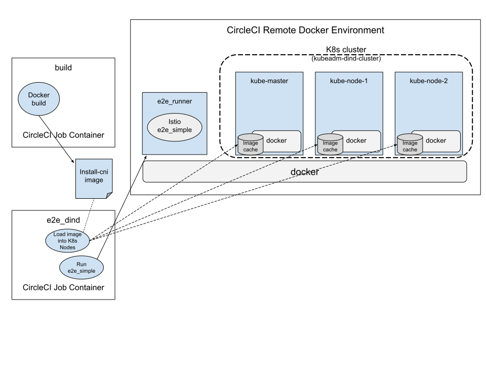

# Istio CNI Plugin Testing

This page describes the testing strategy for the Istio CNI plugin and how to run the tests.

## Types of tests

The CNI has the following tests available.

1. Unit, functional, and lint tests

1. Istio e2e tests triggered on a istio/cni change

1. Istio e2e tests with the CNI enabled triggered on a istio/istio change

1. Manually executed e2e tests

## Test Environments

The primary test environments for testing the Istio CNI plugin are:

1. CircleCI
1. Istio Prow (GKE)
1. Developer private test environments

### CircleCI Testing

The "istio/cni" CircleCI test environment is under the CircleCI Istio organization.  It
consists of 2 workflows:

1. all:  PR events on the "istio/cni" github repository
1. nightly:  triggers every night at 09:45:00 UTC

All CI tests are run by both workflows.  The tests include the unit, functional, and
lint tests as well as an e2e test.

#### CircleCI e2e Tests

The Istio CNI e2e_dind CircleCI job is patterned on the KDC CircleCI jobs.  The
e2e_dind job creates a 3-node Kubernetes cluster via docker-in-docker (DinD)
using the [kubeadm-dind-cluster (KDC)](https://github.com/kubernetes-sigs/kubeadm-dind-cluster)
project.  Each node in the Kubernetes cluster is actually a docker container
hosted on the CircleCI job's "remote" docker instance.  In order to run the
Istio e2e_simple tests against that environment, a e2e_runner container is
run within the same network namespace as the Kubernetes master node
container.  The e2e_runner image is based on the Istio circleci image containing
golang, helm, kubectl, the istio/istio repo, and a simple script that runs
the e2e_simple job with the Istio CNI enabled.

The following illustrates the CircleCI job container relationship with the
"remote" docker containers--Kubernetes on DinD cluster containers and the
e2e_runner container.



The "e2e_dind" job flow is as follows:

1. The build job creates the docker image for the Istio CNI container: "install-cni".

1. The build job persists the "install-cni" docker image for other jobs in the workspace.

1. The e2e_dind job creates the e2e_runner image with the latest istio/istio content.

1. The e2e_dind job brings up a DinD Kubernetes cluster with Flannel as the main CNI plugin type.

1. The e2e_dind job populates the docker cache with the persisted "install-cni" image
   for each Kubernetes node.

1. The e2e_dind job runs the e2e_runner container on the same docker network as the
   Kubernetes cluster's kube-master node.

   1. The e2e_simple test is run by the e2e_runner exec script.

##### kubeadm-dind-cluster (KDC) Comments

- Implementations for multiple Kubernetes versions--since 1.8
- Supports multiple CNI plugin types--weave, flannel, calico, calico_kdd, kube_router
- Supports IPv4 and IPv6

### Istio Prow (GKE)

PR triggers from the istio/istio repo will execute a new prow job added to istio/test-infra called
e2e_simple_cni.  The test wrapper script is added via PR [9557](https://github.com/istio/istio/pull/9577)

The "mason" component of istio/test-infra has been modified to create GKE clusters with
the [network policy](https://cloud.google.com/kubernetes-engine/docs/how-to/network-policy)
feature enabled which is a requirement for GKE to enable the CNI network-plugin
in the installed kubelets.  This has already been merged into istio/test-infra.  The
GKE network policy is enabled by "mason" for prow jobs that call "mason_client"
with `--type=gke-e2e-test-latest` (a.k.a. resource type).

## Test Execution

### Manually Executing Precommit Tests

`make precommit` executes lint and format checks.

### Manually Executing Unit and Functional Tests

To execute all unit and functional tests use the `make test` target.

**NOTE:**  The `install-test` make target requires docker and filesystem host mount
capability.

#### Unit Tests

The following target triggers the Istio CNI plugin unit-tests:

```sh
make cmd-test
```

#### Functional Tests
1. install-test (`make install-test`)
   1. Requires docker
   1. docker runs the `install-cni` container with test dirs mounted and env vars set to known Kubernetes settings
   1. does file compares to determine if the results match the expected configuration

### Manually executed e2e tests

The istio/cni repo will not have its own e2e tests.  The istio/istio e2e
tests will be utilized with the CNI enabled to validate that the CNI correctly interoperates
with the istio/istio code base.  Both the istio/istio repo and the istio/cni repo will have gate tests that run one or more of the Istio e2e tests with the CNI enabled to validate
that the CNI works properly.

In order to run the e2e tests in a local environment confirm:
1. That you can successfully run the desired Istio e2e tests in your local environment without the CNI enabled

2. That your local environment supports the requirements for the CNI plugin

To run any of the Istio e2e test follow these steps:

1. Clone the Istio repo in your local environment.

2. Install the CNI components as decribed on the main README or other sources. This might include building your own images and/or charts or pulling the images and charts from official repositories.

3. Step 2 includes setting appropriate helm values.
The HUB and TAG value can be overridden using the environement variables:
```console
export ISTIO_CNI_HUB=yourhub
export ISTIO_CNI_TAG=yourtag
```
```console
--set "excludeNamespaces={}"
```
4. Run any of the Istio e2e targets after setting up a few environment variables:
```console
export ENABLE_ISTIO_CNI=true
export E2E_ARGS=--kube_inject_configmap=istio-sidecar-injector
```

The tag `$YOUR_CNI_TAG` should be set to the `$TAG` value you used when you built your CNI image.
The hub `$YOUR_CNI_HUB` should be set to the location you used when you built your CNI image.
Istio in most cases runs the e2e tests in the `istio-system` namespace and therefore the `excludeNamespaces` must be set to `NULL`.
The e2e tests normally use `istioctl` to inject the sidecar and it is necessary to use a `ConfigMap` without the `initContainers` section.
Depending on your environment you may need to override other default settings.

If the `tag` and `hub` is not set, the test will use the latest hub and tag values checked into the istio/cni repository.  The default `tag` and `hub` values are fine to use if you do not want to build your own CNI images.
The CNI will not be uninstalled after the test is completed.
